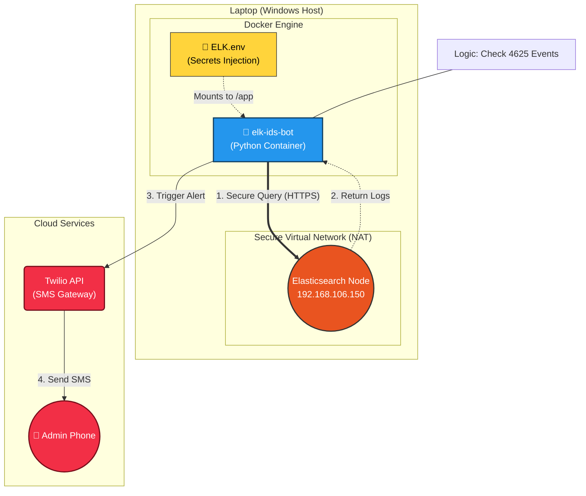

```mermaid
graph TD
    %% Define Styles
    classDef container fill:#2496ED,stroke:#103F61,stroke-width:2px,color:white;
    classDef vm fill:#E95420,stroke:#333,stroke-width:2px,color:white;
    classDef cloud fill:#F22F46,stroke:#780E1B,stroke-width:2px,color:white;
    classDef file fill:#FFD43B,stroke:#333,stroke-width:1px,color:black;

    subgraph Host ["Laptop (Windows Host)"]
        
        subgraph Docker_Engine ["Docker Engine"]
            direction TB
            Container["🐳 elk-ids-bot<br>(Python Container)"]:::container
            EnvFile["📄 ELK.env<br>(Secrets Injection)"]:::file
            
            EnvFile -.->|Mounts to /app| Container
        end
        
        subgraph VMware ["Secure Virtual Network (NAT)"]
            ES(("Elasticsearch Node<br>192.168.106.150")):::vm
        end
    end

    subgraph Internet ["Cloud Services"]
        Twilio("Twilio API<br>(SMS Gateway)"):::cloud
        User(("📱 Admin Phone")):::cloud
    end

    %% Data Flow
    Container == "1. Secure Query (HTTPS)" ==> ES
    ES -.->|2. Return Logs| Container
    
    Container -- "3. Trigger Alert" --> Twilio
    Twilio -- "4. Send SMS" --> User

    %% Styling for the Script logic inside container
    note1[Logic: Check 4625 Events] --- Container
```

