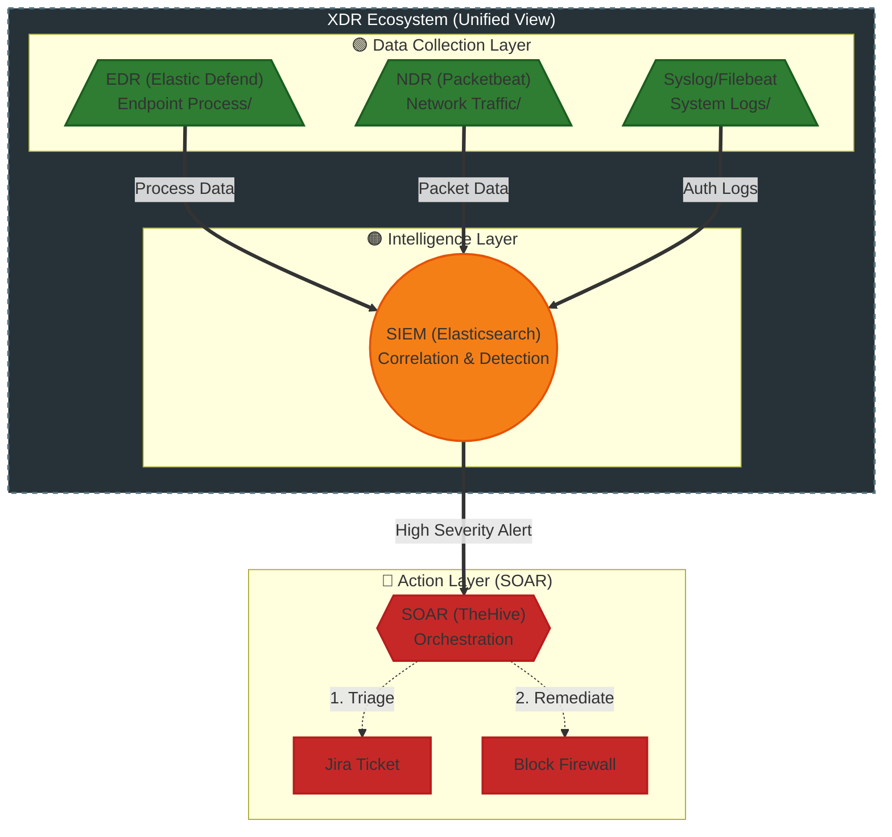

```mermaid
graph TD
    %% Define Styles - Modern Dark Theme
    classDef input fill:#2E7D32,stroke:#1B5E20,stroke-width:2px,color:white;  %% Green
    classDef core fill:#F57F17,stroke:#E65100,stroke-width:2px,color:white;   %% Orange
    classDef action fill:#C62828,stroke:#B71C1c,stroke-width:2px,color:white;  %% Red
    classDef container fill:#263238,stroke:#546E7A,stroke-width:2px,stroke-dasharray: 5 5,color:white;

    subgraph XDR ["XDR Ecosystem (Unified View)"]
        direction TB
        
        subgraph Collection ["🟢 Data Collection Layer"]
            direction LR
            EDR[/"EDR (Elastic Defend)"<br>Endpoint Process/\]:::input
            NDR[/"NDR (Packetbeat)"<br>Network Traffic/\]:::input
            Logs[/"Syslog/Filebeat"<br>System Logs/\]:::input
        end

        subgraph Analysis ["🟠 Intelligence Layer"]
            SIEM(("SIEM (Elasticsearch)"<br>Correlation & Detection)):::core
        end
    end

    subgraph Response ["🔴 Action Layer (SOAR)"]
        SOAR{{"SOAR (TheHive)"<br>Orchestration}}:::action
        Jira[Jira Ticket]:::action
        Block[Block Firewall]:::action
    end

    %% Connections
    EDR ==>|Process Data| SIEM
    NDR ==>|Packet Data| SIEM
    Logs ==>|Auth Logs| SIEM
    
    SIEM ==>|High Severity Alert| SOAR
    SOAR -.->|1. Triage| Jira
    SOAR -.->|2. Remediate| Block

    %% Background Styling
    class XDR container
```
