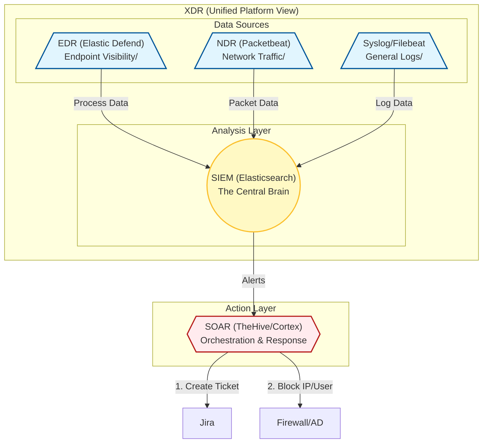

```mermaid
graph TD
    %% Define Styles
    classDef capture fill:#e1f5fe,stroke:#01579b,stroke-width:2px;
    classDef brain fill:#fff9c4,stroke:#fbc02d,stroke-width:2px;
    classDef action fill:#ffebee,stroke:#b71c1c,stroke-width:2px;
    classDef xdr fill:#f3e5f5,stroke:#4a148c,stroke-width:2px,stroke-dasharray: 5 5;

    subgraph XDR_Scope ["XDR (Unified Platform View)"]
        direction TB
        
        subgraph Collection ["Data Sources"]
            EDR[/"EDR (Elastic Defend)"<br>Endpoint Visibility/\]:::capture
            NDR[/"NDR (Packetbeat)"<br>Network Traffic/\]:::capture
            Logs[/"Syslog/Filebeat"<br>General Logs/\]:::capture
        end

        subgraph Analysis ["Analysis Layer"]
            SIEM(("SIEM (Elasticsearch)"<br>The Central Brain)):::brain
        end
    end

    subgraph Response ["Action Layer"]
        SOAR{{"SOAR (TheHive/Cortex)"<br>Orchestration & Response}}:::action
    end

    %% Connections
    EDR -->|Process Data| SIEM
    NDR -->|Packet Data| SIEM
    Logs -->|Log Data| SIEM
    
    SIEM -->|Alerts| SOAR
    SOAR -->|1. Create Ticket| Jira[Jira]
    SOAR -->|2. Block IP/User| Firewall[Firewall/AD]
```
